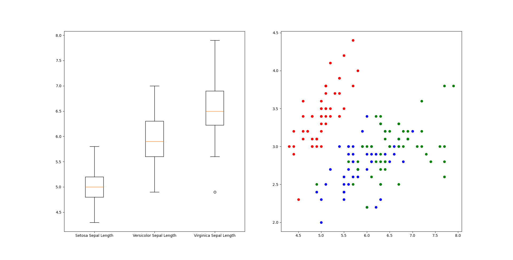
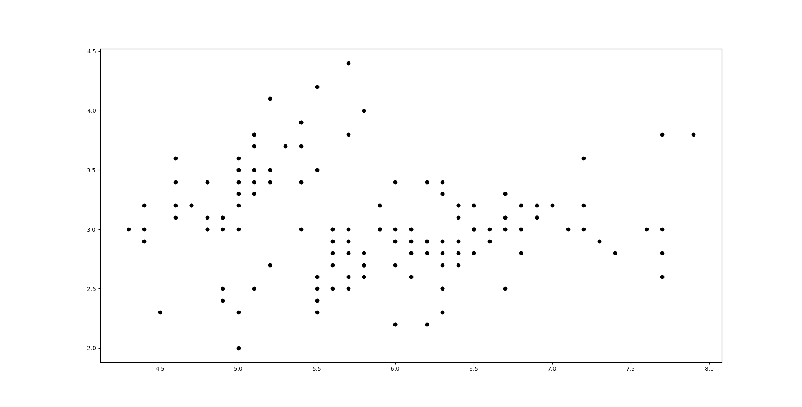
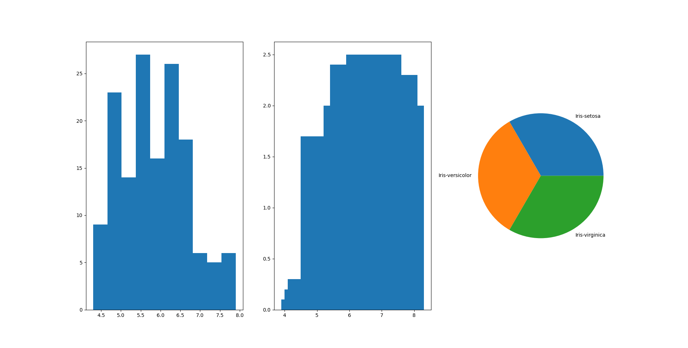

# Practical 03: Visualizations

## Aim

1. Find data distributions using box and scatter plot
2. Find the outliers using plot
3. Plot the histogram, barchart and pie chart on sample data.

## Datasets Used

- <https://www.kaggle.com/uciml/iris> - iris.csv
    columns: SepalLengthCm, SepalWidthCm, PetalLengthCm, PetalWidthCm, Species

## Theory

**Data Visualization:** Data visualization is the graphical representation of information and data. By using visual elements like charts, graphs, and maps, data visualization tools provide an accessible way to see and understand trends, outliers, and patterns in data.

### Key Functions

- `plt.boxplot`: Creates a box-and-whisker plot to visualize the distribution of a numerical variable.
- `plt.scatter`: Creates a scatter plot to visualize the relationship between two numerical variables.
- `plt.plot`: Creates a line plot to visualize the relationship between two numerical variables.
- `plt.hist`: Creates a histogram to visualize the distribution of a numerical variable.
- `plt.bar`: Creates a bar chart to visualize the distribution of a categorical variable.
- `plt.pie`: Creates a pie chart to visualize the distribution of a categorical variable.

## Output Images

## Practical Files

- [a.py](./a.py) - Box and scatter plot
- [b.py](./b.py) - Outliers
- [c.py](./c.py) - Histogram, barchart and pie chart
- *[iris.csv](./iris.csv)
- @[a.png](./a.png)
- @[b.png](./b.png)
- @[c.png](./c.png)
- @[printed_code_output.pdf](./printed_code_output.pdf)