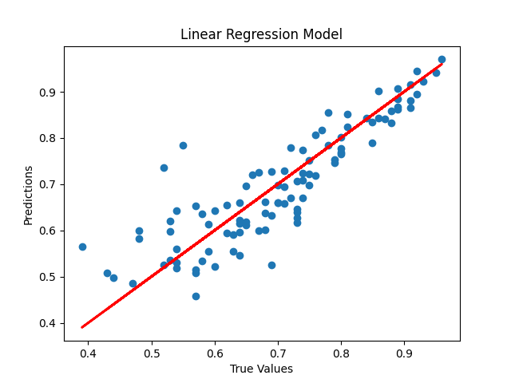

# Practical 06: Multiple Regression Model

## Aim

Apply multiple regressions, if data have a continuous independent variable. Apply on above dataset.

## Theory

Multiple linear regression (MLR), also known simply as multiple regression, is a statistical technique that uses several explanatory variables to predict the outcome of a response variable. The goal of multiple linear regression is to model the linear relationship between the explanatory (independent) variables and response (dependent) variables. In essence, multiple regression is the extension of ordinary least-squares (OLS) regression because it involves more than one explanatory variable.

$$ y_i = \beta_0 + \beta_1 x_i1 + \beta_2 x_i2 ... + \epsilon $$

where for $i = n$ observations:

- $y_i$ is the dependent variable
- $\beta_0$ is the y-intercept
- $\beta_1$ is the slope of the first independent variable
- $x_i$ are the explanatory variables
- $\epsilon$ is the error term

## Output Images

## Practical Files

- [a.py](./a.py)
- @[a.png](./a.png)
- *[admissions-predict.csv](./admissions-predict.csv)
