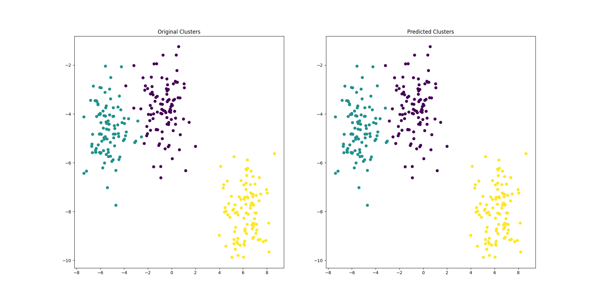

# Practical 08 : Clustering Models

## Aim

a. Clustering algorithms for unsupervised classification.
b. Plot the cluster data using matplotlib visualization.

## Theory

Clustering is an unsupervised learning approach used to group similar data points together based on their similarities and differences. The goal of clustering is to identify meaningful patterns or structures within data, without the need for labeled responses or a pre-existing model. This technique is widely used in various domains, such as image segmentation, anomaly detection, customer segmentation, and gene expression analysis, among others.

Formally, clustering can be defined as follows:

Given a dataset X = {x1, x2, ..., xn} where xi ∈ ℝ^d, the goal of clustering is to partition the dataset into K disjoint subsets, C = {C1, C2, ..., CK}, such that:

1. Each subset Ci contains similar data points.
2. The similarity between data points within the same cluster is maximized.
3. The dissimilarity between data points in different clusters is minimized.

Mathematically, the clustering problem can be formulated as an optimization problem, where the objective is to minimize the intra-cluster distance and maximize the inter-cluster distance.

To solve this optimization problem, various clustering algorithms have been proposed, including:

1. K-Means Clustering: This algorithm aims to partition the dataset into K clusters by minimizing the sum of squared distances between each data point and the centroid of its assigned cluster.
2. Hierarchical Clustering: This algorithm builds a hierarchy of clusters by recursively merging or splitting clusters based on their similarity or dissimilarity.
3. Density-Based Clustering: This algorithm identifies clusters based on the density of data points, where clusters are defined as regions of high density separated by regions of low density.
4. Spectral Clustering: This algorithm uses the eigenvectors of a similarity matrix to identify clusters by analyzing the spectral properties of the data.

In summary, clustering is a powerful unsupervised learning technique used to identify patterns and structures within data. By partitioning data points into meaningful clusters, clustering algorithms can help researchers and practitioners gain insights into complex datasets and make informed decisions based on data-driven evidence.

## Output Images

## Practical Files

- [main.py](./main.py)
- [main.png](./main.png)
- *[iris.csv](./iris.csv)