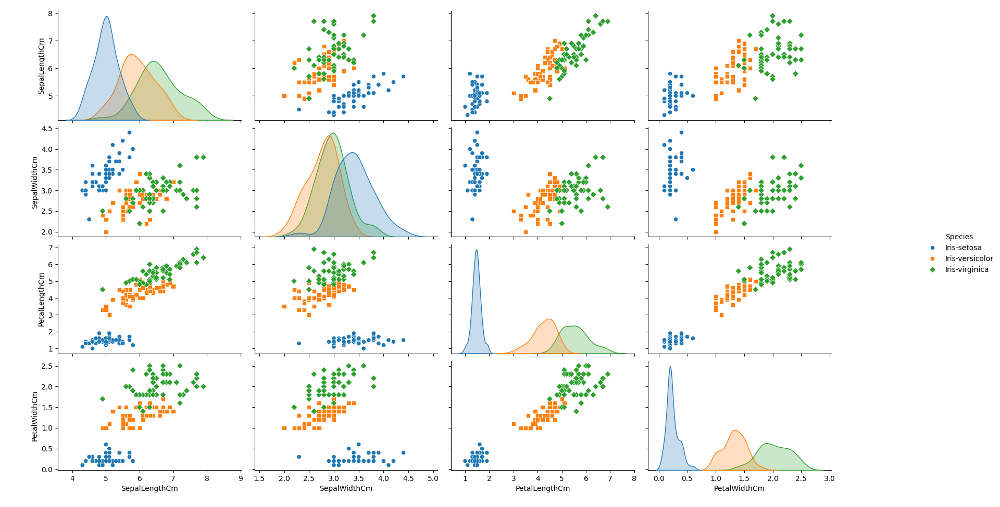
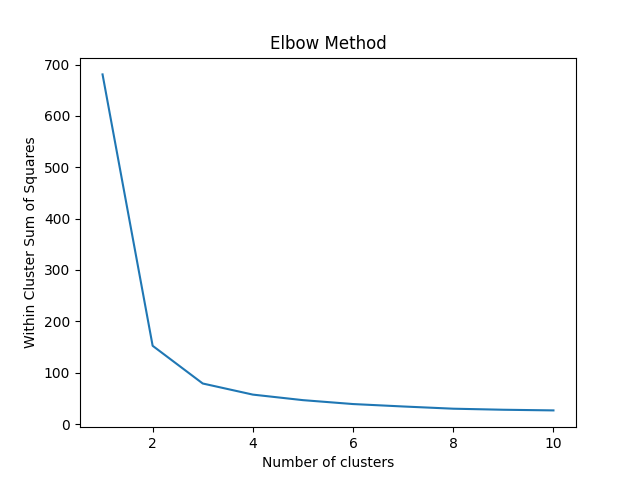
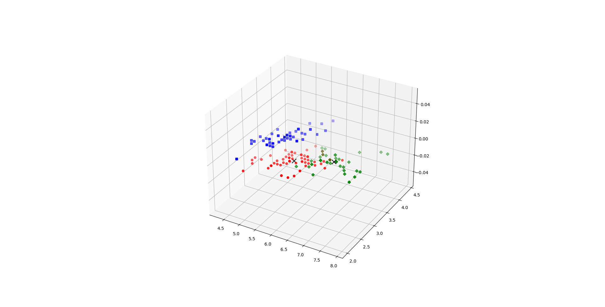

# Practical 10: K-means Clustering

## Aim

Implement k-means clustering algorithm to classify the iris dataset.

## Theory

K-means clustering is a popular unsupervised machine learning algorithm used for partitioning a given dataset into K distinct clusters. The goal is to find a partition such that the data points within each cluster are as close as possible to the cluster's centroid, and data points in different clusters are as far apart as possible.

The algorithm proceeds as follows:

1. Initialize K centroids, either randomly or using a specific initialization method (e.g., K-means++ initialization).

2. Assign each data point to the nearest centroid, forming K clusters.

3. Update the centroids by calculating the mean of the data points in each cluster.

4. Repeat steps 2 and 3 until convergence (i.e., no data point changes its cluster assignment) or a maximum number of iterations is reached.

Formally,

Given a set of N data points $\mathbf{X} = \{\mathbf{x}_1, \mathbf{x}_2, \ldots, \mathbf{x}_N\}$, where each data point $\mathbf{x}_i$ is a d-dimensional vector in $\mathbb{R}^d$, the objective is to partition $\mathbf{X}$ into K disjoint clusters $\mathcal{C} = \{\mathcal{C}_1, \mathcal{C}_2, \ldots, \mathcal{C}_K\}$, such that the sum of squared distances between each data point and the centroid of its assigned cluster is minimized.

The optimization problem can be formulated as:

$$\begin{equation}
\text{minimize} \quad J = \sum_{k=1}^{K} \sum_{\mathbf{x} \in \mathcal{C}_k} \|\mathbf{x} - \boldsymbol{\mu}_k\|^2
\end{equation}$$

where:
- $K$ is the number of clusters
- $\mathcal{C}_k$ is the set of data points in the $k$-th cluster
- $\boldsymbol{\mu}_k$ is the centroid (mean vector) of the $k$-th cluster, calculated as: $\boldsymbol{\mu}_k = \frac{1}{|\mathcal{C}_k|} \sum_{\mathbf{x} \in \mathcal{C}_k} \mathbf{x}$

The assignment step:
$$\mathcal{C}_k = \{\mathbf{x} \in \mathbf{X} \mid \|\mathbf{x} - \boldsymbol{\mu}_k\| \leq \|\mathbf{x} - \boldsymbol{\mu}_j\| \text{ for all } j \neq k\}$$

The update step:
$$\boldsymbol{\mu}_k = \frac{1}{|\mathcal{C}_k|} \sum_{\mathbf{x} \in \mathcal{C}_k} \mathbf{x}$$

The time complexity of the K-means algorithm is $\mathcal{O}(N \times K \times I \times d)$, where $N$ is the number of data points, $K$ is the number of clusters, $I$ is the number of iterations, and $d$ is the dimensionality of the data.

The convergence is guaranteed to a local optimum, but the final clustering may depend on the initial centroid positions. To mitigate this, multiple runs with different initializations can be performed, and the solution with the lowest objective function value can be chosen.

## Datasets Used

- <https://www.kaggle.com/uciml/iris> - iris.csv
    columns: SepalLengthCm, SepalWidthCm, PetalLengthCm, PetalWidthCm, Species

## Practical Files

- [main.py](./main.py)
- @[iris.csv](./iris.csv)
- *[a.png](./a.png)
- *[b.png](./b.png)
- *[c.png](./c.png)

- [code.pdf](./code.pdf)
- [output.pdf](./output.pdf)

## Output Images

